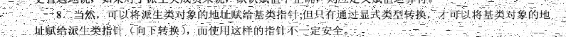
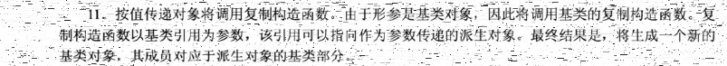
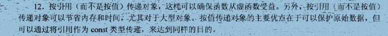
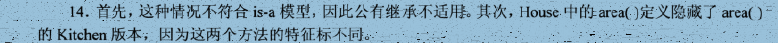

# 13 review

## 1

继承除构造函数以外的公开成员函数，以及成员变量

## 2

无法继承构造函数、析构函数、赋值运算符以及友元函数

## 3

~~无法使用同类型对象进行赋值会得到一个返回对象的副本而不是本身;当对象中包含new时可能会发生意外，比如临时对象析构了，new出来的内存空间被delete了，此时副本成员中指针指向的内存空间为空。~~

仍可使用但是无法使用连锁赋值；执行速度会减慢，因为需要复制对象

## 4

创建子类时，首先调用父类构造函数，然后调用子类构造函数。

析构子类时，首先调用子类的溪谷函数，然后调用父类的析构函数。

## 5

不需要，此时可以创建该子类，但是调用的是父类的默认构造函数

## 6

派生类的方法，派生类的同名方法会隐藏基类的同名方法

## 7

子类成员函数中使用了new时，必须定义赋值运算符

## 8

不可以；可以

## 9

1. 可以，使用强制转换，但是可能有问题

2. 可以，需要定义这种类型的赋值运算符，或者是现将父类通过构造函数转成成子类，然后通过赋值运算符赋值给子类

## 10

可以，基类的指针和引用变量都可以指向派生类

## 11

不知道

## 12

引用传递对象不需要使用复制构造函数

## 13

1. Corporation::head()
2. PublicCorporation::head()

## 14

子类的`area`方法会隐藏父类的`area`方法

